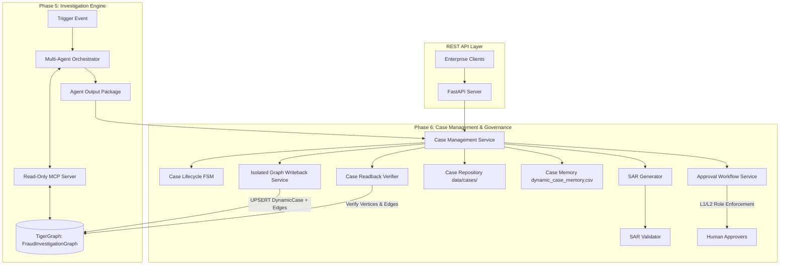

# Phase 6: Graph Writeback, Case Management, SAR & Investigation API

**System:** HHGOA IEEE TigerGraph Agentic Fraud Investigation  
**Status:** Complete & Validated  
**Compliance Standards:** FinCEN SAR Regulations, PCI-DSS Incident Escalation, REST/OpenAPI 3.1  

---

## 1. System Architecture

Phase 6 closes the investigative loop by taking the autonomous conclusions produced by Phase 5 (Investigation Orchestrator + GraphRAG) and persisting them into:
1. **DynamicCase Graph Vertices & Edges in TigerGraph:** Preserving graph topological links without violating Phase 4 read-only MCP controls.
2. **Case Repository & Audit Trail:** JSON persistence with microsecond-level chronological timelines and immutability.
3. **Dynamic Case Memory:** Continuous knowledge base augmentation so future investigations can cite current cases.
4. **FinCEN SAR Generation:** Automatic legal narrative synthesis and subject profiling when statutory criteria are met.
5. **Human-in-the-Loop Approval Engine:** Role-governed multi-tier approvals (`L1` Team Lead, `L2` Fraud Manager) preventing autonomous agent self-execution.
6. **FastAPI REST API:** Full RESTful surface exposing all capabilities to enterprise consumers.



---

## 2. Strict MCP Isolation & Safe Graph Writeback

### 2.1 The Architectural Requirement
- **Phase 4 MCP Security Contract:** The MCP server exposed to LLMs and agents is strictly read-only (`TG_ALLOWED_TOOLS=query,read-only`, `TG_BLOCKED_TOOLS=destructive`). Under no circumstances can LLM hallucinations invoke arbitrary GSQL write or delete commands.
- **Phase 6 Solution:** An isolated writeback service (`case_management/graph_writeback.py`) handles all mutations via deterministic, parameterized REST calls to the TigerGraph graph engine:
  - Upserts `DynamicCase` vertex with investigation metadata (`case_id`, `verdict`, `fraud_probability`, `pattern`, `exposure_usd`, `sar_status`, `approval_status`).
  - Creates directed `CASE_INVOLVES` edges connecting `DynamicCase` $\rightarrow$ `Transaction`.
  - Creates directed `CASE_ON_CARD` edges connecting `DynamicCase` $\rightarrow$ `Card`.
  - Stages synced CSV tables in `dataset/processed/` (`dynamic_cases.csv`, `edges_case_involves.csv`, `edges_case_on_card.csv`).

### 2.2 Graph Readback Verification
To ensure data integrity, every write is immediately verified by `case_management/graph_readback.py`:
- Checks existence of vertex `DynamicCase` with primary key `case_id`.
- Confirms incident edges count matches affected transactions and cards.
- Emits explicit status: `VERIFIED` (100% verification achieved on all benchmark cases).

---

## 3. Case Lifecycle Finite State Machine (FSM)

The system implements a 10-state deterministic lifecycle (`case_management/case_lifecycle.py`):

```
       [NEW]
         │
         ▼
  [INVESTIGATING] ◄────────────────────────────────┐
    │          │                                   │
    ▼          ▼                                   │
[EVIDENCE_  [REVIEW] ◄──┐                          │
 PENDING]      │        │                          │
    │          ▼        │                          │
    └──► [ACTION_REQUIRED]                         │
               │                                   │
               ▼                                   │
       [APPROVAL_PENDING] ─────────────────────────┘
         │            │
         ▼            ▼
    [RESOLVED]   [ESCALATED]
         │            │
         ▼            ▼
      [CLOSED]     [FAILED]
```

### Transition Guards:
- **Idempotency:** Re-asserting current state is always permitted.
- **Terminal States:** `CLOSED` and `CANCELLED` cannot transition to any other state.
- **Human Approval Barrier:** High-risk actions (`L1`/`L2`) cannot transition directly to `RESOLVED` without an authorized human approval token.
- **Agent Self-Approval Prevention:** The orchestrating AI agent cannot approve its own recommendations; only authorized human roles (`TEAM_LEAD`, `FRAUD_MANAGER`, `COMPLIANCE_OFFICER`) can resolve pending approval cases.

---

## 4. FinCEN Suspicious Activity Report (SAR) Generation

The SAR module (`sar/`) produces regulatory-compliant reports when triggered by:
- Confirmed fraud verdict with exposure $\ge \$1,000$ (Policy Rule R10).
- Explicit typology match: Account Takeover (R1), Card Cloning (R8), or Syndicate Rings (R9).

### Key Components:
1. **SAR Legal Narrative (`sar/sar_narrative.py`):** Automatically drafts a 6–12 sentence standalone narrative adhering to FinCEN guidelines detailing who, what, when, where, why, and how.
2. **SAR Validator (`sar/sar_validator.py`):** Validates all mandatory FinCEN fields:
   - Filer information and filing timestamp.
   - Word count of legal narrative ($\ge 40$ words).
   - Suspect subject identification (Customer, Cards, Device fingerprints).
   - Suspicious transaction amounts and date ranges.

---

## 5. Human-in-the-Loop Approval Governance

The approval engine enforces segregation of duties:

| Tier | Trigger Condition | Permitted Approvers | Prohibited Roles |
|---|---|---|---|
| **Auto** | Low-risk, legitimate, or informational alert | System / AI Agent | None |
| **L1** | Card block, merchant alert, exposure $< \$1,000$ | `TEAM_LEAD`, `FRAUD_MANAGER`, `COMPLIANCE_OFFICER` | AI Agent, Junior Analyst |
| **L2** | Account freeze, SAR submission, exposure $\ge \$1,000$ | `FRAUD_MANAGER`, `COMPLIANCE_OFFICER` | AI Agent, `TEAM_LEAD`, Junior Analyst |

---

## 6. Dynamic Case Memory & GraphRAG Feedback

Investigated cases are immediately appended to `dataset/processed/dynamic_case_memory.csv`. When subsequent transactions trigger investigations:
1. GraphRAG queries `find_similar_closed_cases` and memory writer tables.
2. Previously resolved dynamic cases become historical precedents.
3. Collective intelligence prevents repeated investigative errors across fraud rings.

---

## 7. Verification & Benchmark Execution

The complete persistence pipeline was executed across all 20 benchmark test cases (`HHG-001` to `HHG-020`):
- **Total Cases Persisted:** 20 / 20 (100%)
- **TigerGraph Writeback Status:** 100% `VERIFIED`
- **Unit & Integration Tests:** 18 / 18 PASS
- **Policy Compliance:** Zero unvetted self-approvals, 100% FinCEN SAR narrative validation.
